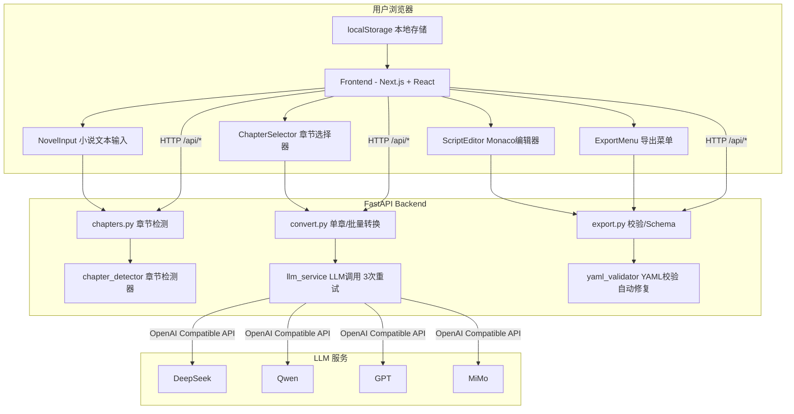
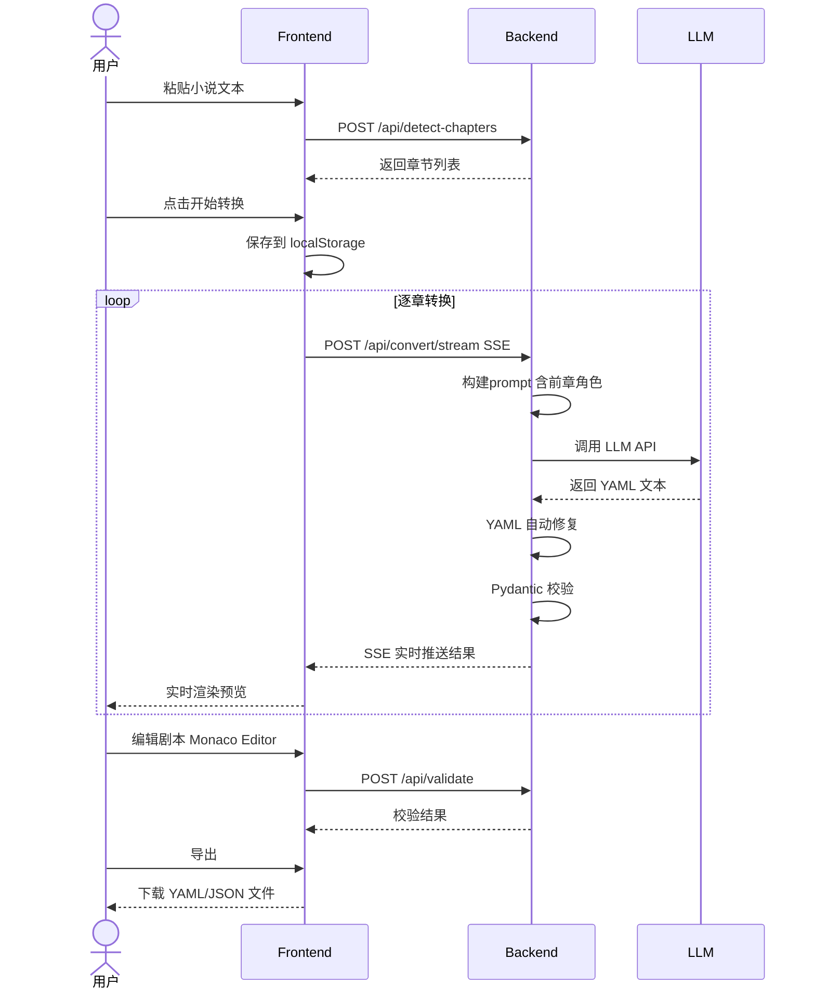
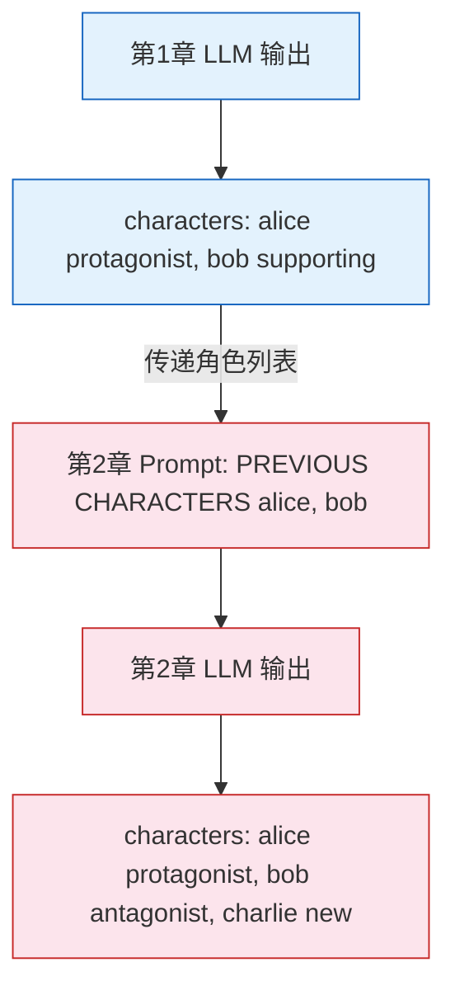
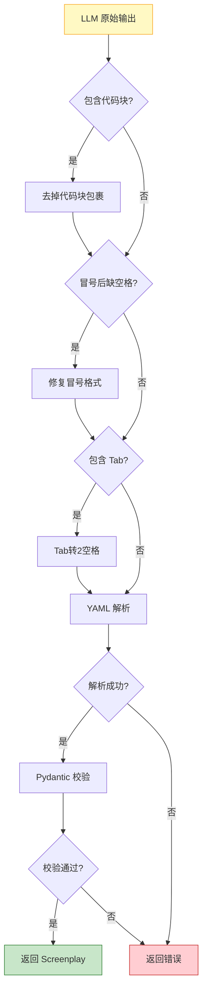
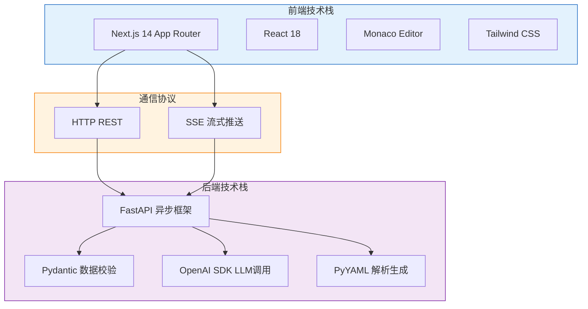

# Novel2Scripts 架构图

## 系统架构总览

```mermaid
graph TB
    subgraph Browser["用户浏览器"]
        UI["Frontend - Next.js + React"]
        NovelInput["NovelInput 小说文本输入"]
        ChapterSelector["ChapterSelector 章节选择器"]
        ScriptEditor["ScriptEditor Monaco编辑器"]
        ExportMenu["ExportMenu 导出菜单"]
        LS["localStorage 本地存储"]
    end

    subgraph Backend["FastAPI Backend"]
        chapters["chapters.py 章节检测"]
        convert["convert.py 单章/批量转换"]
        export["export.py 校验/Schema"]
        detector["chapter_detector 章节检测器"]
        llm["llm_service LLM调用 3次重试"]
        validator["yaml_validator YAML校验 自动修复"]
    end

    subgraph LLM["LLM 服务"]
        DeepSeek["DeepSeek"]
        Qwen["Qwen"]
        GPT["GPT"]
        MiMo["MiMo"]
    end

    NovelInput --> chapters
    ChapterSelector --> convert
    ScriptEditor --> export
    ExportMenu --> export

    chapters --> detector
    convert --> llm
    export --> validator

    LS --> UI
    UI --> NovelInput
    UI --> ChapterSelector
    UI --> ScriptEditor
    UI --> ExportMenu

    UI -- "HTTP /api/*" --> chapters
    UI -- "HTTP /api/*" --> convert
    UI -- "HTTP /api/*" --> export

    llm -- "OpenAI Compatible API" --> DeepSeek
    llm -- "OpenAI Compatible API" --> Qwen
    llm -- "OpenAI Compatible API" --> GPT
    llm -- "OpenAI Compatible API" --> MiMo
```

## 数据流

```mermaid
sequenceDiagram
    actor User as 用户
    participant FE as Frontend
    participant BE as Backend
    participant LLM as LLM

    User->>FE: 粘贴小说文本
    FE->>BE: POST /api/detect-chapters
    BE-->>FE: 返回章节列表

    User->>FE: 点击开始转换
    FE->>FE: 保存到 localStorage

    loop 逐章转换
        FE->>BE: POST /api/convert/stream SSE
        BE->>BE: 构建prompt 含前章角色
        BE->>LLM: 调用 LLM API
        LLM-->>BE: 返回 YAML 文本
        BE->>BE: YAML 自动修复
        BE->>BE: Pydantic 校验
        BE-->>FE: SSE 实时推送结果
        FE-->>User: 实时渲染预览
    end

    User->>FE: 编辑剧本 Monaco Editor
    FE->>BE: POST /api/validate
    BE-->>FE: 校验结果

    User->>FE: 导出
    FE-->>User: 下载 YAML/JSON 文件
```

## 核心组件关系

```mermaid
graph LR
    text["小说文本"] --> detect["章节检测"]
    detect --> prompt["Prompt 构建"]
    prompt --> llmCall["LLM 调用"]
    llmCall --> fix["YAML 修复"]
    fix --> validate["Schema 校验"]
    validate --> screenplay["Screenplay"]
    screenplay --> files["YAML/JSON 文件"]

    style text fill:#e1f5fe,stroke:#0288d1
    style detect fill:#fff3e0,stroke:#f57c00
    style prompt fill:#fff3e0,stroke:#f57c00
    style llmCall fill:#fff3e0,stroke:#f57c00
    style fix fill:#fff3e0,stroke:#f57c00
    style validate fill:#fff3e0,stroke:#f57c00
    style screenplay fill:#e8f5e9,stroke:#388e3c
    style files fill:#e8f5e9,stroke:#388e3c
```

## 角色 ID 线程化机制

```mermaid
graph TD
    LLM1["第1章 LLM 输出"] --> C1["characters: alice protagonist, bob supporting"]
    C1 -- "传递角色列表" --> PROMPT2["第2章 Prompt: PREVIOUS CHARACTERS alice, bob"]
    PROMPT2 --> LLM2["第2章 LLM 输出"]
    LLM2 --> C2["characters: alice protagonist, bob antagonist, charlie new"]

    style LLM1 fill:#e3f2fd,stroke:#1565c0
    style C1 fill:#e3f2fd,stroke:#1565c0
    style PROMPT2 fill:#fce4ec,stroke:#c62828
    style LLM2 fill:#fce4ec,stroke:#c62828
    style C2 fill:#fce4ec,stroke:#c62828
```

## YAML 自动修复流程

```mermaid
flowchart TD
    RAW["LLM 原始输出"] --> CHECK1{"包含代码块?"}
    CHECK1 -- 是 --> STRIP["去掉代码块包裹"]
    CHECK1 -- 否 --> CHECK2
    STRIP --> CHECK2{"冒号后缺空格?"}
    CHECK2 -- 是 --> FIX_COLON["修复冒号格式"]
    CHECK2 -- 否 --> CHECK3
    FIX_COLON --> CHECK3{"包含 Tab?"}
    CHECK3 -- 是 --> FIX_TAB["Tab转2空格"]
    CHECK3 -- 否 --> PARSE
    FIX_TAB --> PARSE["YAML 解析"]
    PARSE --> PARSE_OK{"解析成功?"}
    PARSE_OK -- 是 --> VALIDATE["Pydantic 校验"]
    PARSE_OK -- 否 --> ERROR["返回错误"]
    VALIDATE --> VALID_OK{"校验通过?"}
    VALID_OK -- 是 --> SUCCESS["返回 Screenplay"]
    VALID_OK -- 否 --> ERROR

    style RAW fill:#fff9c4,stroke:#f9a825
    style SUCCESS fill:#c8e6c9,stroke:#2e7d32
    style ERROR fill:#ffcdd2,stroke:#c62828
```

## 技术栈

```mermaid
graph TB
    subgraph Frontend["前端技术栈"]
        NextJS["Next.js 14 App Router"]
        React["React 18"]
        Monaco["Monaco Editor"]
        Tailwind["Tailwind CSS"]
    end

    subgraph Backend["后端技术栈"]
        FastAPI["FastAPI 异步框架"]
        Pydantic["Pydantic 数据校验"]
        OpenAI_SDK["OpenAI SDK LLM调用"]
        PyYAML["PyYAML 解析生成"]
    end

    subgraph Protocol["通信协议"]
        HTTP["HTTP REST"]
        SSE["SSE 流式推送"]
    end

    NextJS --> HTTP
    NextJS --> SSE
    HTTP --> FastAPI
    SSE --> FastAPI
    FastAPI --> Pydantic
    FastAPI --> OpenAI_SDK
    FastAPI --> PyYAML

    style Frontend fill:#e3f2fd,stroke:#1565c0
    style Backend fill:#f3e5f5,stroke:#7b1fa2
    style Protocol fill:#fff3e0,stroke:#f57c00
```
