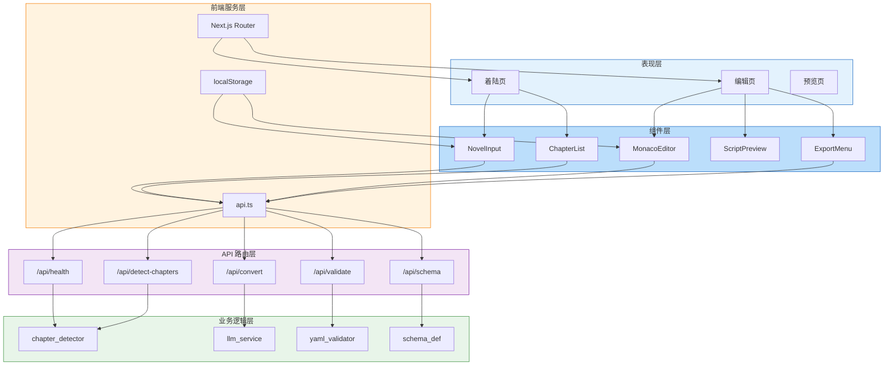

# 应用架构图

## 分层职责

| 层次 | 职责 | 技术实现 |
|------|------|----------|
| 表现层 | 页面路由与布局 | Next.js App Router |
| 组件层 | UI 交互与展示 | React + Tailwind |
| 服务层 | 数据通信与存储 | fetch + localStorage |
| API 路由层 | 请求分发 | FastAPI Router |
| 业务逻辑层 | 核心处理 | Python 服务类 |
