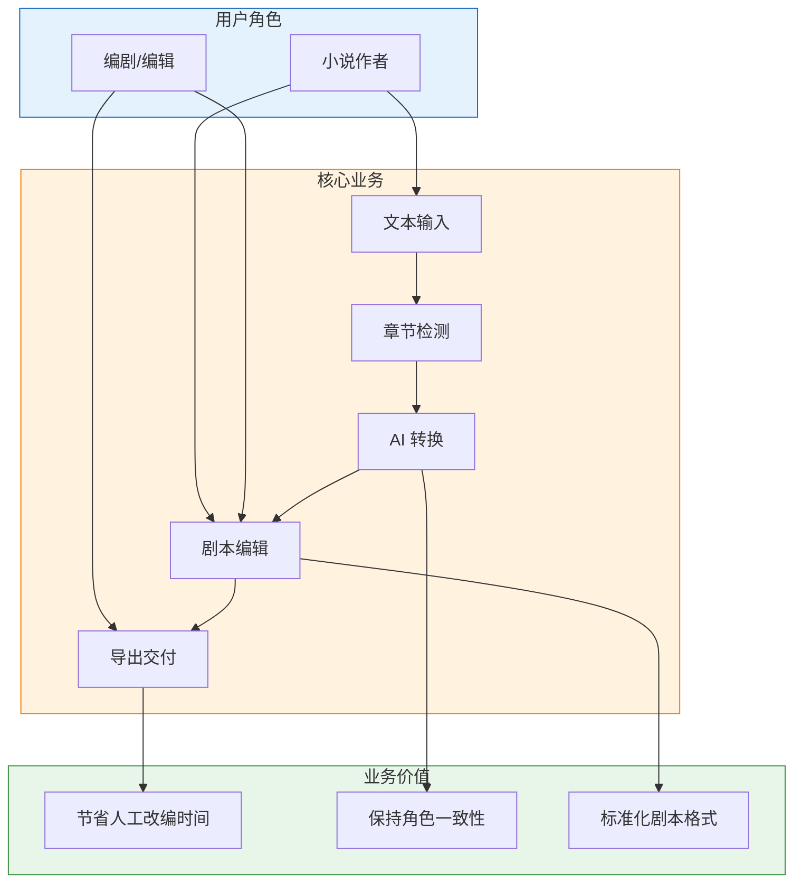

# 业务架构图

## 业务流程说明

| 阶段 | 输入 | 输出 | 价值 |
|------|------|------|------|
| 文本输入 | 小说原文 | 结构化文本 | 降低使用门槛 |
| 章节检测 | 原始文本 | 章节列表 | 自动化分割 |
| AI 转换 | 章节文本 | YAML 剧本 | 智能改编 |
| 剧本编辑 | YAML 剧本 | 修改后剧本 | 人工精修 |
| 导出交付 | 最终剧本 | YAML/JSON 文件 | 标准化输出 |
