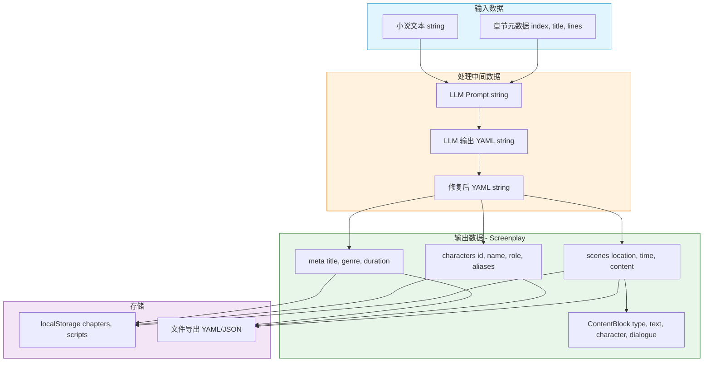
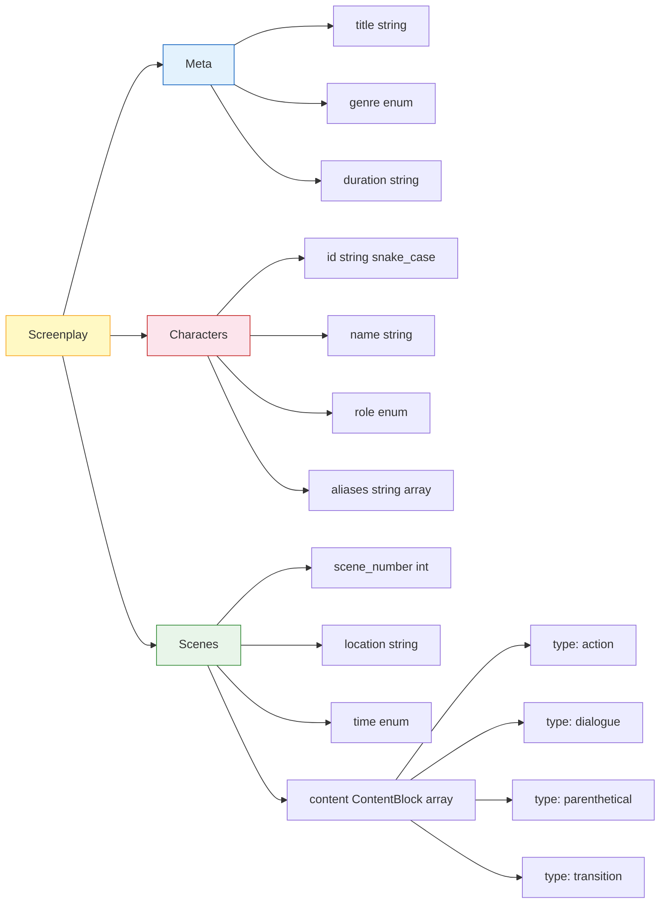

# 数据架构图

## 数据模型 - Screenplay

## 数据流转路径

| 阶段 | 数据格式 | 处理方式 |
|------|----------|----------|
| 用户输入 | 纯文本 | textarea 采集 |
| 章节检测 | JSON | regex 模式匹配 |
| LLM 调用 | Prompt string | OpenAI SDK |
| LLM 输出 | YAML string | 流式返回 |
| YAML 修复 | YAML string | regex 替换 |
| 数据校验 | Pydantic Model | 类型验证 |
| 前端存储 | JSON string | localStorage |
| 文件导出 | YAML/JSON | Blob 下载 |

## 枚举值定义

| 字段 | 可选值 |
|------|--------|
| genre | drama, comedy, thriller, romance, horror, action, scifi, fantasy, literary, other |
| role | protagonist, antagonist, supporting, minor, narrator |
| type | action, dialogue, parenthetical, transition, scene_heading |
| time | 黎明, 白天, 黄昏, 夜晚, 连续 |
