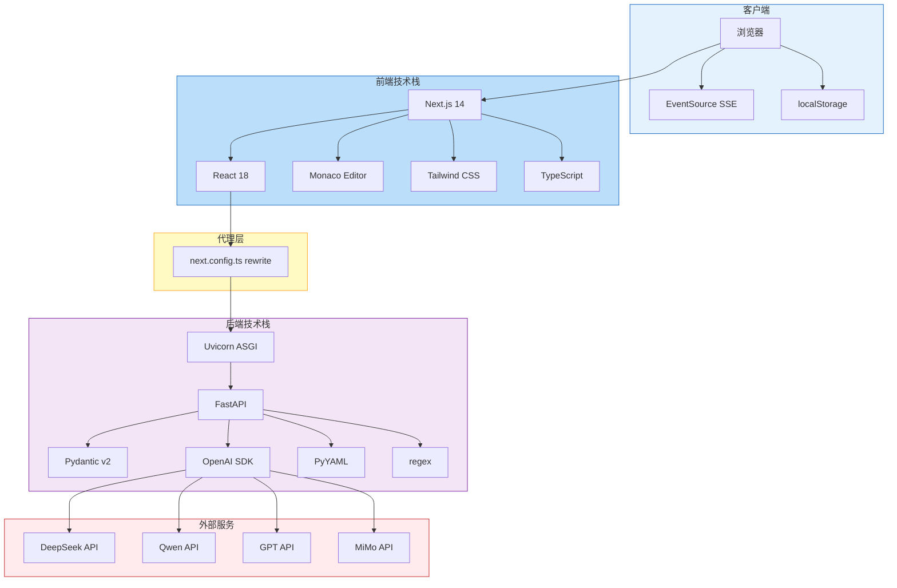

# 技术架构图

## 技术选型

| 层次 | 技术 | 版本 | 选型理由 |
|------|------|------|----------|
| 前端框架 | Next.js | 14 | App Router, SSR/CSR 灵活切换 |
| UI 框架 | React | 18 | 组件化开发，生态成熟 |
| 编辑器 | Monaco Editor | - | VS Code 同款，YAML 高亮 |
| 样式 | Tailwind CSS | 3 | 原子化 CSS，开发效率高 |
| 后端框架 | FastAPI | - | 异步支持好，自动 OpenAPI 文档 |
| 数据校验 | Pydantic | v2 | 类型安全，Schema 生成 |
| LLM 调用 | OpenAI SDK | - | 兼容多家 LLM API |
| YAML 处理 | PyYAML | - | 解析/生成 YAML |
| 通信协议 | HTTP + SSE | - | REST + 流式推送 |
